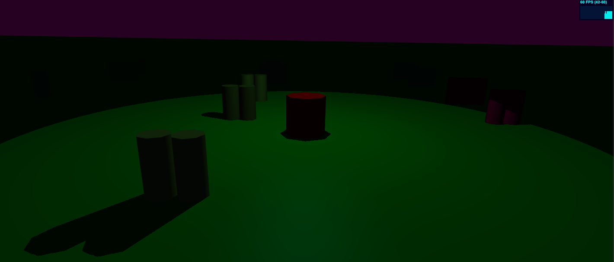
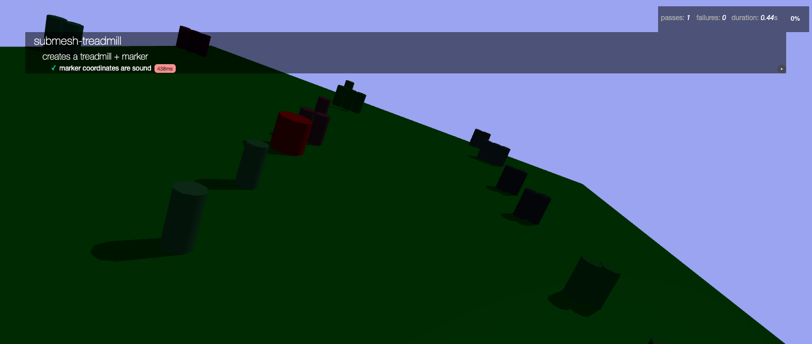

submesh-treadmill
=================

[  ](https://khrome.github.io/submesh-treadmill/)

This is a 3D treadmill for navigating through scenes much larger than can fit into memory, it could be used to visualize maps, make a game or visualize a simulation which is compatible with off the shelf physics systems([CANNON.js](https://www.npmjs.com/package/cannon-es)). It also supports (but does not require) browser native modules.

At it's core, it's a tiling engine that keeps the target marker centered in the "current" tile and shifts (and loads) tiles as the user exits out of this region. In this way all you need to do is build a loading interface which loads a tile and it's corresponding markers. If you choose to build these tiles generatively, in an unbounded context, this should work until the coordinate system goes out of range (in a future update this will change so that the max bounds is the submesh addresses going out of range). Lifecycle events are also coming soon.

| northeast | north     | northwest |
|-----------|-----------|-----------|
| east      | current   | west      |
| southeast | south     | southwest |         

Usage
-----
TBD (check the tests)


Testing
-------



Run the tests headless.
```bash
npm run test
```
to run the same test inside the browser:

```bash
npm run browser-test
```
to run the same test headless inside docker:

```bash
npm run container-test
```